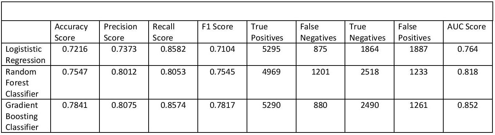

# Rideshare Churn Predictor

This is a case study to predict churn using real-world data from a ride-sharing company. 

### The Problem Statement

What factors lead to user "churn" (losing users) and what are some measures 
we can implement to prevent loss? 

We would like you to use this data set to help understand **what factors are
the best predictors for retention**, and offer suggestions to help Company X. 
Therefore, your task is not only to build a
model that minimizes error, but also a model that allows you to interpret the
factors that contributed to your predictions.

### The Data

To help explore this question and to put into practice, Galvanize, the Data Science Immersive Program 
located in San Francisco, have provided a sample dataset of a cohort of users who signed up for an account 
in January 2014. The data was pulled on July 1, 2014; we consider a user retained if they were “active” 
(i.e. took a trip) in the preceding 30 days (from the day the data was pulled). In other words, a user is "active" 
if they have taken a trip since June 1, 2014. The data, churn.csv, is in the data folder. 
The data are split into train and test sets.

##### Data Manipulation & Feature Engineering

My data pipeline is outlined by the following process:

1) Sort the data by last trip date in ascending order.
2) Fill in missing ratings data with the average rating of all riders and drivers respectively.
3) Drop the remaining records that contain any sort of missing values (justified this action
        after finding just a few hundred records missing (exactly 319) from phone device data).
4) Convert last trip date from pandas object to datetime format.
5) Create a "churn" column based on standards of activity described above.
6) Create column in Boolean value if app user's device is an iPhone.
7) Convert luxury car indicator to Boolean.
8) Create dummy variables for city.

For more information on the data itself can be found in the `README.md` located in `~/data/` folder.

### The Model

Models:
1. Logistic Regression
2. Random Forest Classier
3. Gradient Boosting

I will train three different classifiers with the same training data to see which classification model
will perform the best for further use of newly acquired data.

##### The Results

This table provides a breakdown of performance scores from the three classification models.

**Logistic regression** has the highest recall score (highest sensitivity) but has the lowest accuracy, precision
and F1 score. This classifier itself produces a high positive turnout. 

**Random forest** in comparison to logistic regression performed better in accuracy, precision, and F1 score, 
sacrificing a bit in sensitivity. Still random forest classification showing with this data to be a better model
than logistic regression.

**Gradient boosting** performed the best of the other models. 
Gradient boosting has a high recall score as long as high scores in precision and accuracy.
This classifier has the highest AUC score of the three models suggesting it has the highest probability
of the other two classifiers to correctly place a positive and negative user to it's proper respective classes for
prediction purposes. 

The plot of the ROC curve with the three models also highlights gradient boosting classification 
being the top performer.

### Conclusion

Based on the gradient boosting model, I took a look at the feature importance to see what variables had more weight
in the classification process.

The chart shows the top 4 factors:
1) `avg_rating_by_driver`: The rider's average rating across all of their trips.
2) `surge_pct`: The percent of trips taken with the surge percentage greater than 1.
3) `city_King's Landing`: Users from King's Landing city.
4) `weekday_pct`: The percentage of user trips during the weekdays. 

These factors either positively or negatively affect the retention rate of users. Focusing on these particular factors
could provide the correct measures a company can take to retain customers on the brink of leaving the app.

Based exploration and analysis of predicted results, the classifier suggests the higher average ratings of riders, 
and those that don't use the app during surge pricing do not return,
and users who use ridesharing more often during weekdays and/or are from King's Landing city 
have a strong likelihood of returning.

This is an interesting finding as well-behaved riders don't come back. Also it seems users from King's Landing
are our frequent returning users (as this city may require more public transportation than other cities.)

### Future Work

With this information, and more exploration on other factors and the common tendencies of users that return,
we can move forward and strategize how to prevent customers from leaving, providing any type of incentive to stay
and to keep using the app. It seems as if riders with best ratings/best behavior have a tendency to not use the 
app frequently, it may mean the less rides they take the higher their rating is. Nonetheless this would be a focal
point for future exploration and study.

We could also implement a cost-benefit method to provide additional promotions/discounts available to certain users
that are in danger of not coming back to the app. A lot can be added to this study to improve loyalty and user 
population on our ridesharing application. 